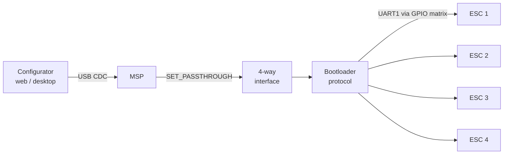

<div align="center">

# AM32 Programmer · ESP32-S3

**A USB programmer for 4-in-1 ESCs, built on a Seeed XIAO ESP32-S3.**

Configure and flash AM32, BLHeli_32 and BLHeli_S ESCs without a flight controller.


</div>

---

## How it works

To the configurator, the programmer looks like a Betaflight flight controller. It answers MSP until the configurator asks for passthrough, then switches the same USB port over to the BLHeli 4-way protocol. The ESC index the configurator sends picks which of the four signal pads is used. One USB cable reaches all four ESCs of a 4-in-1.



**Works with:** [AM32 Configurator](https://am32.ca), [ESC Configurator](https://esc-configurator.com), BLHeliSuite32 and the Betaflight Configurator's ESC tab.

## Hardware

| ESC | XIAO pin | GPIO |
|:---:|:---:|:---:|
| 1 | D5 | 6 |
| 2 | D4 | 5 |
| 3 | D3 | 4 |
| 4 | D10 | 9 |

- Put a **470 Ω series resistor** in each signal line, close to the XIAO. It limits current when both sides drive the line at once, and it protects the GPIO.
- Add a **10 kΩ pull-up to 3V3** on each line if the leads are longer than a few centimetres. The internal pull-up is weak.
- **Power the ESC from its own supply** with props off, and connect its ground to the XIAO's ground. The programmer does not power the ESC.

| Onboard LED | Meaning |
|---|---|
| off | waiting for the configurator |
| on | passthrough session active |
| flashing | reading or writing ESC memory |

Pins, timings and USB identity are all set in [`main/config.h`](main/config.h).

## Build & flash

```bash
idf.py set-target esp32s3
idf.py build flash
```

Requires ESP-IDF v5.3 or newer; tested on v6.0.1. The component manager fetches `esp_tinyusb` automatically.

> [!TIP]
> After the first flash, the app takes over the USB port, so esptool can no longer reset the board into download mode. To reflash, **hold BOOT, tap RESET, release BOOT**, then flash as usual.

> [!IMPORTANT]
> If an old `sdkconfig` exists, delete it before building. `sdkconfig.defaults` sets the 1 kHz tick and keeps the console off USB, and both are required.

## Why the S3 and not the C3?

The AM32 Configurator only lists serial ports whose USB vendor ID is on a built-in allow-list. Espressif's `0x303A` isn't on it. The C3's USB descriptors are fixed in ROM. The S3 has a USB-OTG peripheral, so TinyUSB can present as an STM32 virtual COM port (`0483:5740`), the same as a real flight controller.

> [!WARNING]
> That vendor ID belongs to STMicroelectronics. It is fine for a bench tool, but don't ship a product with it.

## Diagnostic trace

The board shows up as **two** serial ports. Interface 0 carries the protocol for the configurator. Interface 2 is a readable trace of every MSP request, 4-way command and bootloader exchange:

```bash
tio /dev/serial/by-id/usb-STMicroelectronics_STM32_Virtual_ComPort_esc4way-s3-if02
```

A successful command ends with `-> ack 00`. Turn the trace off with `ESC4W_LOG_ENABLE` in `config.h`.

## Safety

Every frame is checked by a CRC on both hops, from the configurator to the programmer and from the programmer to the ESC. A corrupted transfer returns an error instead of being written. If a flash write fails partway, the ESC's bootloader is left intact and you can flash it again. The real risk is flashing firmware built for the wrong target.

**First time?** Read the ESCs, then change one setting, then reflash the version already installed, and only then try a new firmware.

## Credits

The 4-way interface and bootloader protocol are ported from [Betaflight](https://github.com/betaflight/betaflight) (`serial_4way.c`, `serial_4way_avrootloader.c`). The bit-banged UART is replaced by a hardware UART whose signals are routed through the GPIO matrix to the selected pad.
